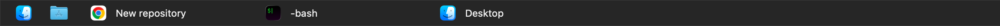

# MacTaskbar



A basic Windows-style taskbar for macOS.

## Run

```sh
swift run
```

MacTaskbar opens a floating bar along the bottom of each display and lists windows that are visible on that display. Click an item to activate the app that owns that window. Right-click empty taskbar space to refresh or quit.

Static pinned items live near the top of `Sources/main.swift` in `pinnedItems`.

## Current Scope

- Shows static pinned items before window entries
- Shows pinned items as compact icon-only buttons
- Opens your home folder in Finder and the Applications folder from default pins
- Shows individual visible windows on each display
- Uses dark taskbar styling by default
- Uses fixed-width taskbar entries with truncated long titles
- Highlights the active app
- Activates all windows for a window's owning app when clicked
- Shows entry right-click menus with Activate and Quit
- Shows a taskbar background right-click menu with Refresh and Quit MacTaskbar
- Splits window items across displays
- Keeps window order stable when focus changes
- Follows display size and arrangement changes
- Stays visible across Spaces and fullscreen contexts where macOS allows it

Window titles come from macOS window metadata; some apps may only expose the app name.

## Missing

- Window grouping/aggregation is not implemented. Each visible window is shown as its own taskbar entry.
- Exact selection between multiple windows from the same app is not reliable without Accessibility APIs. Apps like VS Code may show separate entries, but clicking one can only activate the owning app, not force macOS to focus that exact window.
- MacTaskbar does not reserve screen space like the Dock. macOS maximize/zoom actions still use the system visible area and may place windows behind the taskbar.
- Window updates are polling-based, so there can still be a short delay before newly opened, closed, moved, or renamed windows appear.

## Styling

Basic appearance values live near the top of `Sources/main.swift` in `TaskbarSettings`:

- `barMaterial`
- `barBackgroundColor`
- `focusedEntryColor`
- `normalEntryColor`
- `entryTextColor`
- `entryCornerRadius`

## License

MIT

Created with Codex.
